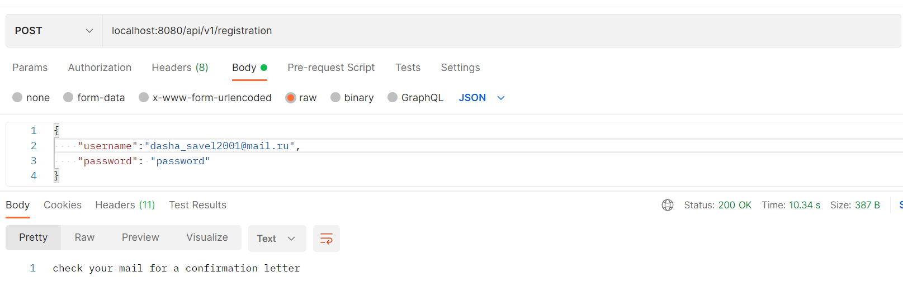
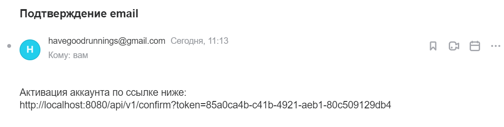
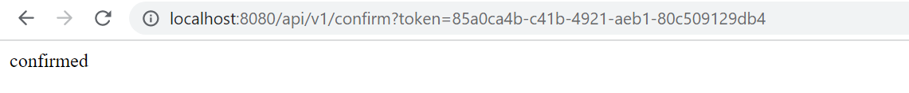
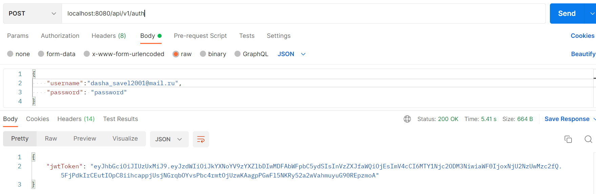
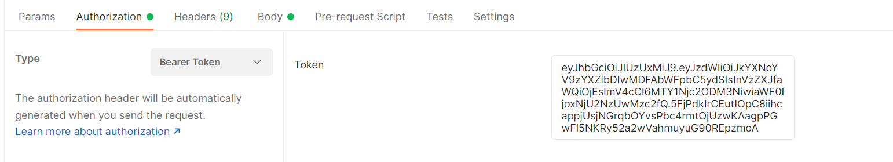
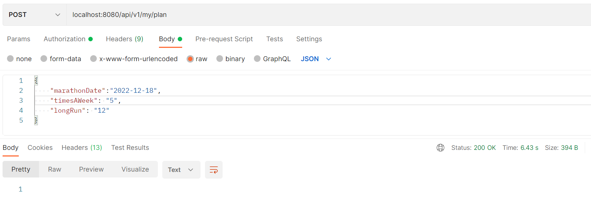
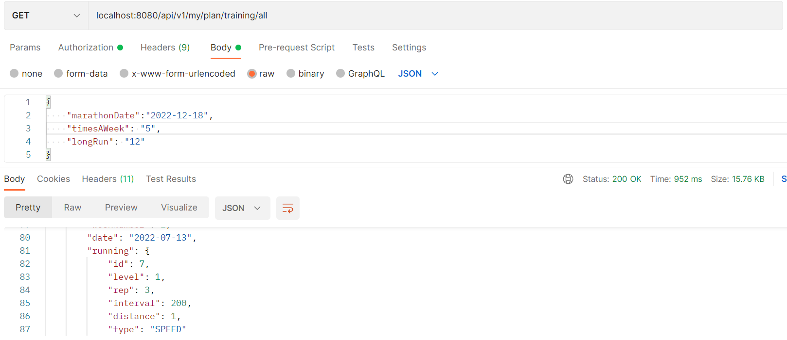
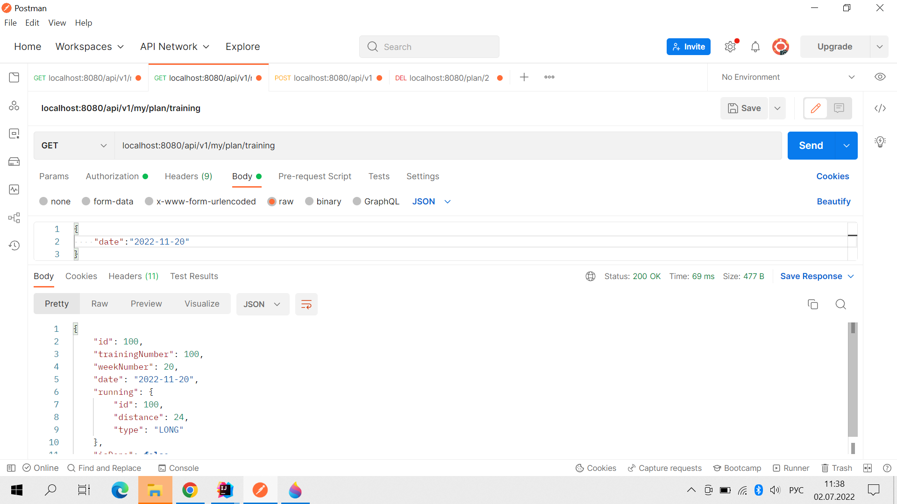
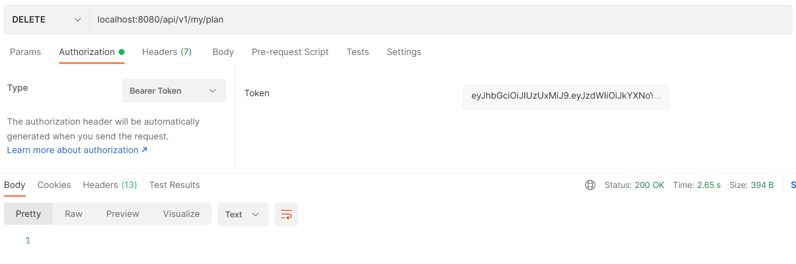
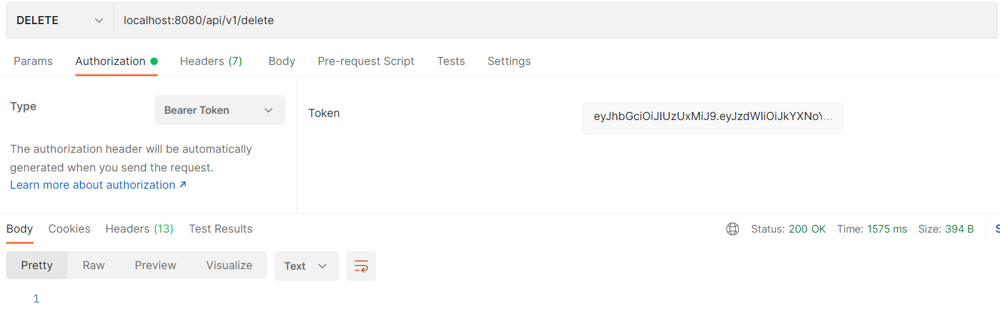

# run-app

This app can help people to prepare for a marathon. It creates plan depended on the date of marathon, how many times a week you want to train(3-5) and your last running distance.
It contains registration with confirmation letters, authentication, creating plan and getting trainings with dates and distances.
There are 4 type of training: 
- speed running
- ordinary running
- long running
- gym (if you want to train 5 times a week).

By default, start of preparing is beginning of next week or if today is Monday - this week; and as usual date of marathon is sunday, so app consider this.

Технологии: Spring Boot, Spring Data JPA, Spring Security.
БД: PostgreSQL

Основные эндпоинты:

- api/v1/registration [POST] - регистрация нового пользователя

- Подтверждение регистрации:

- api/v1/auth [POST] - аутентификация, выдача jwt-токена

С каждым следующим запросом должен идти выданный токен:

- api/v1/my/plan [POST] - создание бегового плана

- api/v1/my/plan/training/all [GET] - получение всех тренировок

- api/v1/my/plan/training [GET] - получение тренировки по дате
 
- api/v1/my/plan [DELETE] - удаление плана

- api/v1/delete [DELETE] - удаление пользователя

Требуется заполнить application.yml:
- spring.datasource.password,
- spring.datasource.url,
- spring.datasource.username,
- spring.mail.host,
- spring.mail.port,
- spring.mail.username,
- spring.mail.password.
