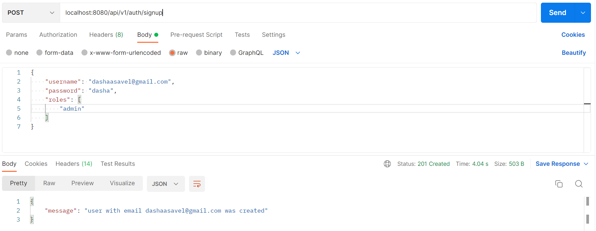
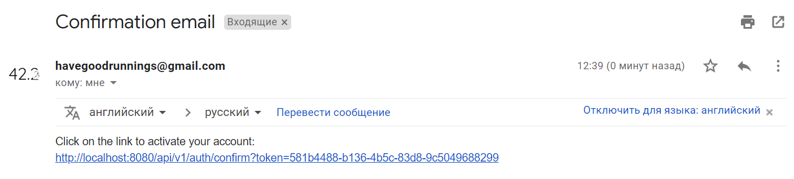
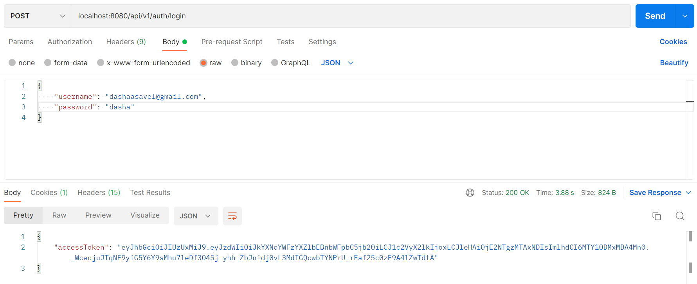
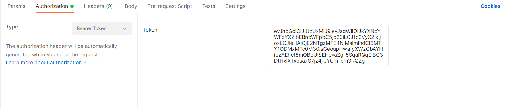
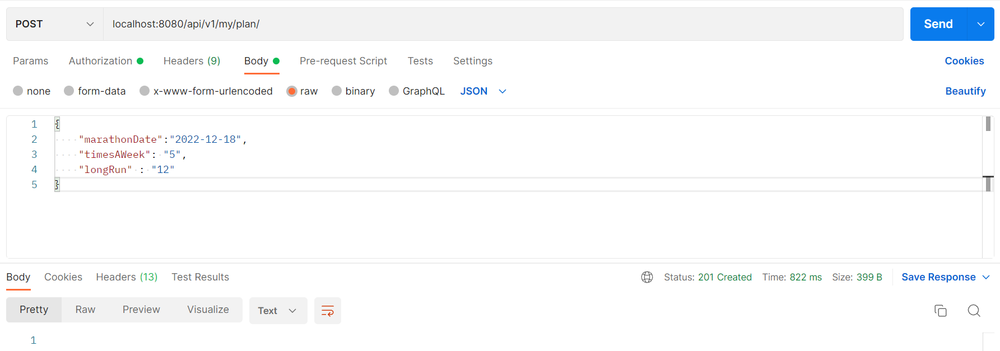
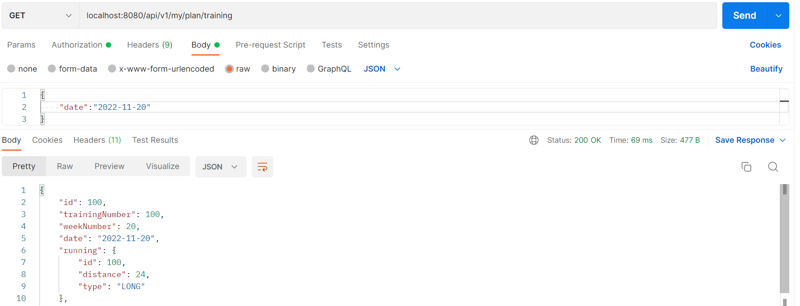
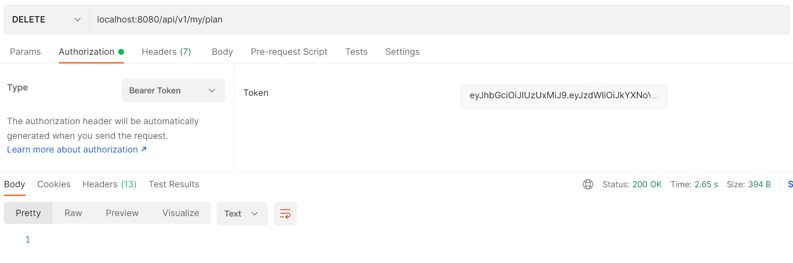
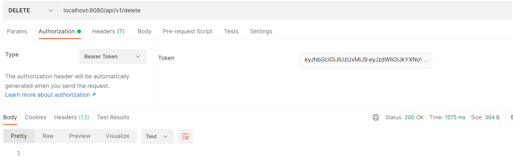

# Run your best app
**Descripion**:

This app can help people to prepare for a marathon. It creates plan depending on the date of marathon, how many times a week you want to train (3-5) and your last running distance.
It contains registration with confirmation letters, authentication (jwt tokens) and authorization, creating plan and getting trainings with dates and distances.

There are 4 type of training:
- speed running
- ordinary running
- long running
- gym (if you want to train 5 times a week).


By default, start of preparing is beginning of next week or if today is Monday - this week; and as usual date of marathon is Sunday, so app consider this.


## Tech stack:

Spring Boot, Spring Data JPA, Spring Security.

**Database** : PostgreSQL

**Build** : Maven

<h3> Compile </h3>

```
mvn package
```

<h3> Run </h3>

```
java -jar target/userSystem-0.0.1-SNAPSHOT.jar
```
<h3>Required to fill gaps in application.yml: </h3>
- spring.datasource.password,
- spring.datasource.url,
- spring.datasource.username,
- spring.mail.host,
- spring.mail.port,
- spring.mail.username,
- spring.mail.password.

## Main endpoints:

- api/v1/signup [POST] - register new user
  
  <sub> After registration user need to confirm email so there is a confirmation link in an email. The link is valid within 15 minutes </sub>
- api/v1/auth/confirm?token=%token% [GET] - confirm account
  
- api/v1/auth/login [POST] - authorization and authentication
  <sub> Response contains body with access token (exp. time = 2 minutes) and HttpOnly cookie with refresh token (exp. time = 30 days).   </sub>
  
  <sub> All next request should contain access token in Authorization header </sub>
- api/v1/auth/refresh [POST] - get new access token (need cookie)
  
- api/v1/my/plan [POST] - creating marathon plan
  
- api/v1/my/plan/training/all [GET] - get list with all trainings
  
- api/v1/my/plan/training [GET] - get training by date
  
- api/v1/my/plan [DELETE] - deleting plan
  
- api/v1/auth/logout [POST] - log out user
  
- api/v1/delete [DELETE] - deleting user
  